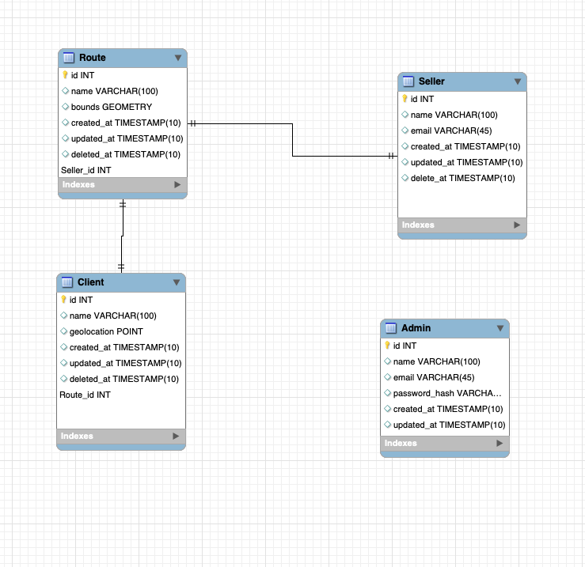
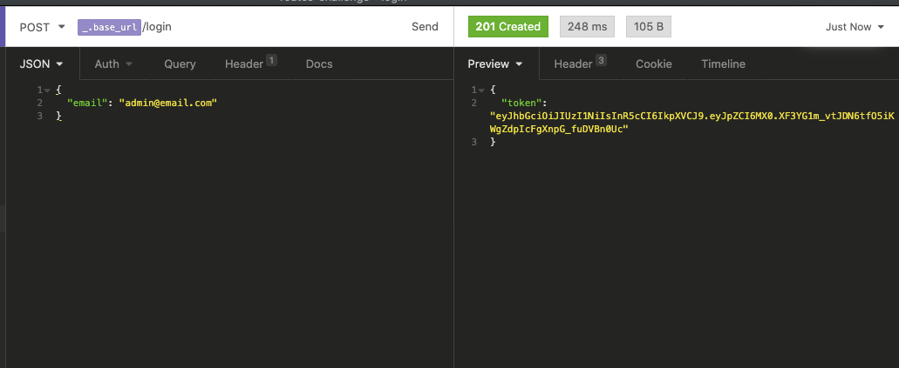
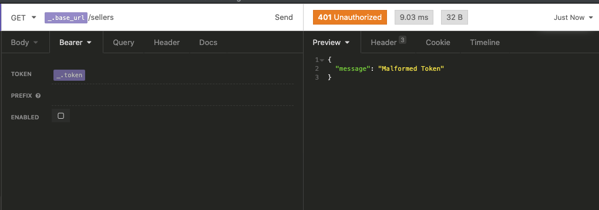
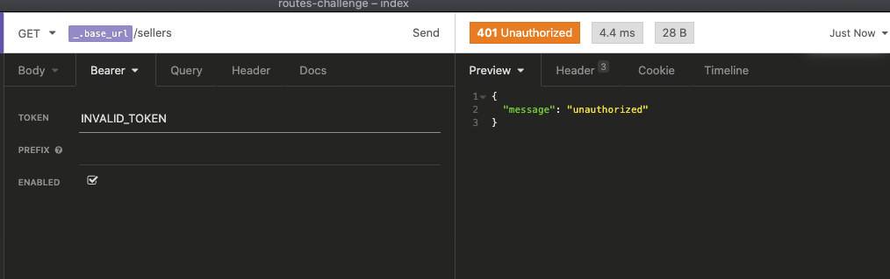
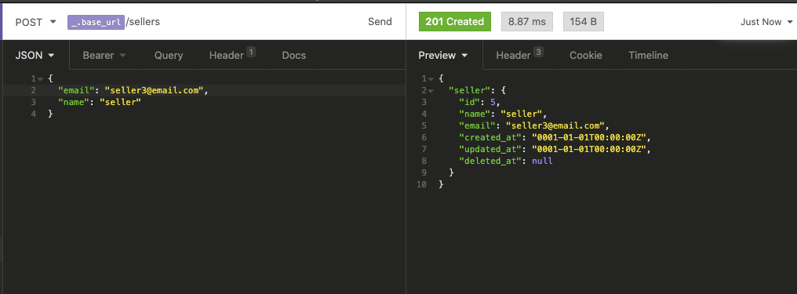
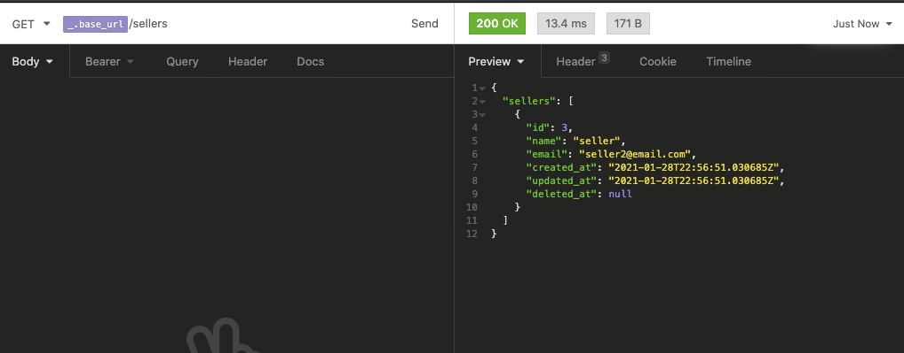
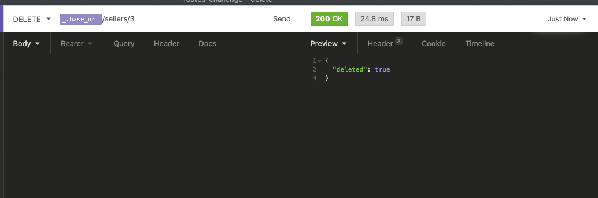

# Routes API

### O que é?

É uma API para cadastrar rotas comerciais, clientes e vendedores. Os vendedores são associados a uma rota e nessa rota possui os clientes que o vendedor entra em contato.

Essa API foi implementada usando a linguagem Go, usando Docker e Postgresql (Postgis).

### Arquitetura

A ideia foi seguir algo na linha da arquitetura hexagonal e arquitetura limpa.

## Modelagem do banco de dados

**config**

- _db/migrations_: aqui ficam as migrações de banco de dados, resolvi colocar dentro do projeto pensando no caso de ter algum outro desenvolvedor é interessante que todos tenham o banco com as alterações
- _db/seeds_: um arquivo go que popula o banco com o admin e a rota "Outros"

- _http-routes_ é um arquivo onde é definido as rotas e qual controller vai ser usado para aquela requisição

**controllers**: aqui é onde ficam os controllers que vão lidar com as requisições

**entities**: as entidades da aplicação (administradores, vendedores, rotas e clientes)

**infra**: aqui fica toda a parte de serviços como banco de dados, JWT, toda parte que não é regra de negócio mas que a nossa aplicação precisa para funcionar

**middlewares**: o middleware de autenticação para verificar se é um administrador que está fazendo a requisição

**repositories**: o padão repositório usado para acessar banco de dados

**usecases**: as nossas regras de negócio ficam aqui em vez de ficar no controller ou na entity.

**validators**: onde ficam as validações dos dados.

### Padrão de commits e branchs

Usei um padrão do [git-commit-msg-linter](https://www.npmjs.com/package/git-commit-msg-linter) e para criação de branch o padrão do gitflow.

### Testes

Foquei bastante nos testes unitários, utilizada uma lib chamada [testify](https://github.com/stretchr/testify) para simplificar as asserções nos testes. Em alguns arquivos eu criei mais de uma função para testar com um sufixo \_Success ou \_Error (Failure) e em outros eu usei um padrão da comunidade de criar uma lista de cenários de testes.

Como foquei bastante em testes unitários ter desenvolvido orientado a interfaces como a arquitetura hexagonal sugere, eu tive a vantagem de conseguir fazer mocks de algumas funções, por exemplo testes de usecases/controllers não é necessária a conexão com um banco de dados, basta saber o tipo de retorno do repository e com isso eu consigo testar o meu usercase/controler.

Para "mockar" o banco de dados foi utiliza a lib [go-sqlxmock](https://github.com/zhashkevych/go-sqlxmock) pois para conectar com o banco foi utilizada a [sqlx](https://github.com/jmoiron/sqlx) já que ela simplifica a conexão e as queries e parse de dados para Structs do Go.

Caso queira rodar os testes pode usar o comando \*_docker-compose run api go test ./..._ ou de forma local _go test ./..._

### Como rodar

1- Com o docker instalado pode usar o comando _docker-compose up_

2 - Caso queira criar uma migration pode usar uma cli chamada [golang-migrate](https://github.com/golang-migrate/migrate) e tem um Makefile basta rodar o command _make migrateup_ ou _make migratedown_

**docker-compose run api make migratedown**
**docker-compose run api make migrateup**

### Requisições

Na pasta docs tem um arquivo insomnia.json que pode importar no Insomnia e fazer as requisições

### O que precisa ser feito e melhorias

1 - Criar mais Validators para não fazer validações nos usecases, talvez usar o padrão Composity para adicionar vários validators

2 - Escrever uma documentação melhor com o Swagger
